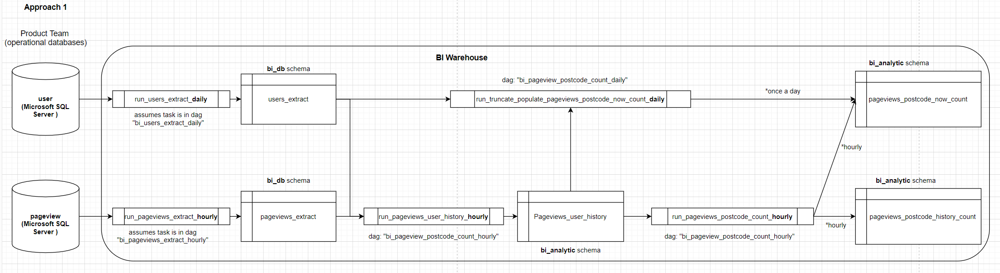
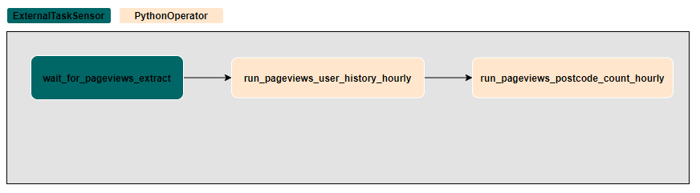
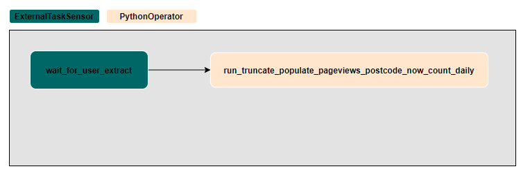

# Pageviews Count ETL Code
The file contains ETL solution to produce:

a.	Number of pageviews for a giver period based on recent postcode of users.  
b.	Number of pageviews for a giver period based on historical postcode of users. 

Below is the proposed design:

Airflow is used as a ETL scheduler

There is two main dags:

A.	Hourly Dag:  bi_pageview_postcode_count_hourly.py

The flow chart of the hourly dag:

B.	Daily Dag: bi_pageview_postcode_count_daily.py

The flow chart of the daily dag:

